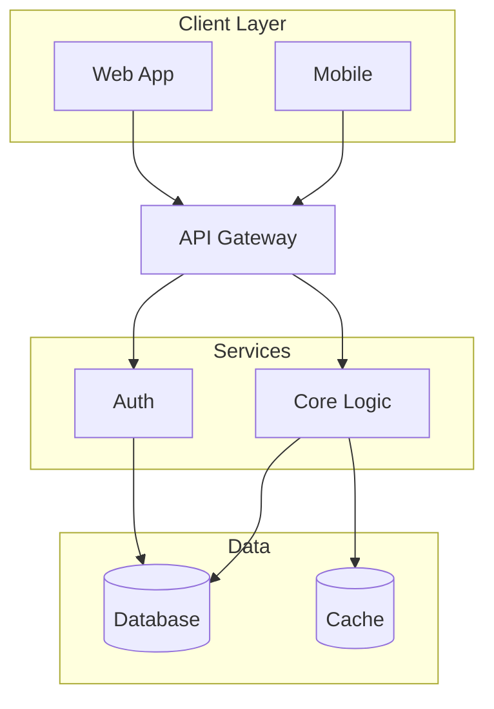
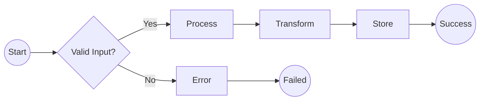

# Mermaid Diagram Integration Guide

This guide explains how to use the integrated Mermaid diagram generation feature in the Twitter/X content generator.

## Overview

The system automatically generates technical diagrams for "Conceptual Deep Dive" threads, creating mobile-friendly visualizations that enhance your technical content.

## Features

- **Automatic Diagram Generation**: Creates diagrams based on your topic
- **4 Diagram Types**: Architecture, Workflow, Sequence, and State diagrams
- **Smart Type Detection**: Automatically selects diagram type based on keywords
- **Two Rendering Methods**: Local CLI (fast) or Web API (no installation)
- **Mobile-Optimized**: Limited nodes and clean layouts for Twitter

## Usage

### 1. Generate Content with Diagrams (Default)

```bash
# Generates thread + diagram automatically
venv/bin/python unified_tweet_generator.py "Docker architecture" \
  --template ConceptualDeepDive \
  --content-type Thread
```

### 2. Generate Without Diagrams

```bash
# Skip diagram generation
venv/bin/python unified_tweet_generator.py "AI agents" --no-diagram
```

### 3. Generate Diagram Only

```bash
# Just create a diagram without tweets
venv/bin/python unified_tweet_generator.py "Microservices workflow" \
  --diagram-only \
  --output workflow.mmd
```

### 4. Test Diagram Generator Directly

```bash
# Architecture diagram
venv/bin/python mermaid_diagram_generator.py "Docker architecture" \
  --type architecture \
  --output docker.mmd \
  --render

# Workflow diagram
venv/bin/python mermaid_diagram_generator.py "CI/CD pipeline" \
  --type workflow

# State diagram
venv/bin/python mermaid_diagram_generator.py "Agent behavior" \
  --type state

# Sequence diagram
venv/bin/python mermaid_diagram_generator.py "API interaction" \
  --type sequence
```

## Diagram Type Selection

The system automatically selects diagram types based on keywords:

- **Architecture**: Default for system/component topics
- **Workflow**: Keywords like "process", "pipeline", "workflow"
- **State**: Keywords like "state", "behavior", "agent"
- **Sequence**: Keywords like "api", "interaction", "sequence"

## Output Files

When diagrams are generated:
- **Mermaid Code**: `generated_diagrams/diagram_YYYYMMDD_HHMMSS.mmd`
- **PNG Image**: `generated_diagrams/diagram_YYYYMMDD_HHMMSS.png` (if rendering succeeds)

## Rendering Options

### Option 1: Mermaid CLI (Recommended)
```bash
# Install globally (requires npm)
sudo npm install -g @mermaid-js/mermaid-cli

# Or run setup script
./setup_mermaid.sh
```

### Option 2: Web API (No Installation)
The system automatically falls back to Kroki.io API if CLI is not available.

### Manual Rendering
```bash
# Using CLI
mmdc -i diagram.mmd -o diagram.png -t dark -b transparent

# Using Kroki.io
curl https://kroki.io/mermaid/png --data-binary @diagram.mmd > diagram.png
```

## Integration with Web Interface

The web interface at `http://localhost:5000` automatically includes diagram generation for Conceptual Deep Dive templates.

## Example Diagrams

### Architecture Diagram


### Workflow Diagram


## Customization

To customize diagram generation, edit topic-specific logic in `mermaid_diagram_generator.py`:

```python
def generate_diagram_for_topic(self, topic: str, diagram_type: DiagramType,
                              context: Optional[Dict] = None) -> Dict:
    # Add your topic-specific customizations here
```

## Best Practices

1. **Keep It Simple**: Max 8-10 nodes for readability
2. **Short Labels**: 15-20 characters per label
3. **Clear Hierarchy**: Use subgraphs for grouping
4. **Mobile First**: Test at 50% zoom
5. **Consistent Style**: Use the same diagram type for similar content

## Troubleshooting

### Rendering Failed
- Check internet connection (for API rendering)
- Verify Mermaid CLI installation: `mmdc --version`
- Check diagram syntax in generated `.mmd` file

### Diagram Too Complex
- Reduce number of nodes
- Simplify connections
- Break into multiple diagrams

### API Errors
- Kroki.io may have rate limits
- Large diagrams may timeout
- Use CLI rendering for reliability

## Future Enhancements

- [ ] Custom diagram templates per topic
- [ ] Interactive diagram editing
- [ ] Multiple diagrams per thread
- [ ] Diagram caching for common topics