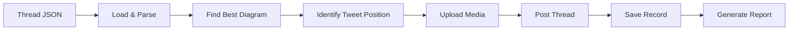

# Phase 4: Tweet + Diagram Binding Pipeline

Complete implementation for binding tweets with diagrams and posting to Twitter/X.

## 🎯 Overview

Phase 4 handles:
1. **Diagram Matching**: Finds best matching diagram for thread topics
2. **Tweet Binding**: Attaches diagrams to appropriate tweets
3. **Media Upload**: Handles Twitter media upload via Tweepy
4. **Thread Posting**: Posts complete threads with proper reply chains
5. **Logging & Reporting**: Comprehensive posting summaries

## 📁 Components

### Core Modules

1. **`tweet_diagram_binder.py`**
   - Main module for tweet-diagram binding
   - Smart matching algorithm using keyword similarity
   - Handles multiple thread JSON formats
   - Dry-run mode for testing

2. **`twitter_publisher.py`**
   - Tweepy v2 + v1.1 hybrid implementation
   - Media upload and tweet posting
   - Thread support with reply chains
   - Error handling and retries

3. **`posting_summary.py`**
   - Generates posting reports
   - Tracks success/failure rates
   - Creates human-readable summaries

### Supporting Scripts

- **`batch_post_threads.sh`**: Batch process multiple threads
- **`phase4_demo.py`**: Complete demo of the pipeline
- **`test_phase4_complete.py`**: Test environment setup

## 🚀 Quick Start

### 1. Setup Environment

```bash
# Install dependencies
venv/bin/pip install tweepy

# Set Twitter API credentials
export API_KEY='your_api_key'
export API_SECRET='your_api_secret'
export ACCESS_TOKEN='your_access_token'
export ACCESS_TOKEN_SECRET='your_access_token_secret'
```

### 2. Prepare Diagrams

Place optimized PNG diagrams in `/home/kushagra/X/optimized/`:
```
optimized/
├── docker_architecture_opt.png
├── microservices_flow_opt.png
└── kubernetes_cluster_opt.png
```

### 3. Post a Single Thread

```bash
# Dry run first
venv/bin/python tweet_diagram_binder.py thread.json --dry-run

# Actually post
venv/bin/python tweet_diagram_binder.py thread.json
```

### 4. Batch Processing

```bash
# Process all threads in a directory
./batch_post_threads.sh --thread-dir generated_threads/ --pattern "*.json"

# With custom diagram directory
./batch_post_threads.sh --diagram-dir ~/my_diagrams --dry-run
```

## 📊 Diagram Matching Algorithm

The binder uses a multi-factor scoring system:

1. **Exact Word Matches**: Keywords that match exactly (weight: 1.0)
2. **Partial Matches**: Similar words using SequenceMatcher (weight: 0.5)
3. **Substring Matches**: Keywords found within diagram names (weight: 0.3)

Example matching:
- Topic: "Docker Container Lifecycle"
- Keywords: ["docker", "container", "lifecycle"]
- Diagram: "docker_lifecycle_opt.png"
- Score: High (contains "docker" and "lifecycle")

## 📝 Thread JSON Format

The binder supports multiple formats:

### Format 1: Generated by unified_tweet_generator
```json
{
  "topic": "Docker Architecture",
  "generatedTweets": ["tweet1", "tweet2", "..."],
  "diagram": {
    "type": "architecture",
    "placement": {"tweet_number": 3}
  }
}
```

### Format 2: Simple format
```json
{
  "topic": "Microservices",
  "tweets": ["tweet1", "tweet2", "..."]
}
```

## 🔍 Diagram Placement Logic

1. **Explicit Placement**: Uses `diagram.placement.tweet_number` if provided
2. **Indicator Detection**: Looks for keywords like "diagram", "chart", "visual"
3. **Default**: Places on 2nd tweet (1st is usually introduction)

## 📈 Posting Workflow



## 🛠️ Advanced Usage

### Custom Diagram Directory
```bash
venv/bin/python tweet_diagram_binder.py thread.json \
  --diagram-dir /path/to/diagrams
```

### Debug Mode
```bash
# Enable debug logging
export LOG_LEVEL=DEBUG
venv/bin/python tweet_diagram_binder.py thread.json --dry-run
```

### Posting Reports
```bash
# Analyze posting history
venv/bin/python posting_summary.py --analyze

# Generate detailed report
venv/bin/python posting_summary.py --report
```

## 📋 Posting Records

Successfully posted threads are saved to `posted_threads/`:
```json
{
  "posted_at": "2024-01-15T10:30:00",
  "topic": "Docker Architecture",
  "tweet_count": 6,
  "tweets_with_media": 1,
  "responses": [
    {
      "id": "1234567890",
      "text": "Tweet content...",
      "url": "https://twitter.com/i/web/status/1234567890"
    }
  ]
}
```

## ⚠️ Error Handling

The pipeline handles common errors:
- **Missing Diagrams**: Logs warning, posts without media
- **Large Files**: Skips files over 5MB
- **API Errors**: Retries with exponential backoff
- **Rate Limits**: Adds delays between posts

## 🎯 Best Practices

1. **Test First**: Always use `--dry-run` before posting
2. **Name Diagrams Well**: Use descriptive names for better matching
3. **Check File Sizes**: Keep diagrams under 5MB
4. **Monitor Rate Limits**: Space out batch posts
5. **Save Records**: Keep posting records for analytics

## 🧪 Testing

### Run Complete Test
```bash
# Setup test environment
venv/bin/python test_phase4_complete.py

# Test with sample data
venv/bin/python tweet_diagram_binder.py test_docker_lifecycle_thread.json --dry-run
```

### Test Specific Components
```bash
# Test Twitter connection
venv/bin/python test_twitter_publisher.py

# Test diagram matching only
venv/bin/python -c "
from tweet_diagram_binder import TweetDiagramBinder
binder = TweetDiagramBinder()
print(binder.available_diagrams)
"
```

## 📊 Example Output

### Dry Run Output
```
============================================================
🔍 DRY RUN - Thread: Docker Architecture Deep Dive
============================================================

📝 Tweet 1/6:
   Text: 🐳 Let's dive deep into Docker architecture!...
   
📝 Tweet 3/6:
   Text: Here's a visual breakdown of the Docker architecture:
   📸 Image: docker_architecture_opt.png
   📁 Path: /home/kushagra/X/optimized/docker_architecture_opt.png
   📊 Size: 125.3 KB
```

### Posting Summary
```
📊 POSTING SUMMARY
================================
📌 Topic: Docker Architecture Deep Dive
🕐 Posted at: 2024-01-15T10:30:00
🧵 Total tweets: 6
📸 Tweets with media: 1

✅ Thread posted successfully!
```

## 🚀 Next Steps

1. **Automate Generation → Posting**: Create end-to-end pipeline
2. **Schedule Posts**: Add cron job for regular posting
3. **Analytics Integration**: Track engagement metrics
4. **A/B Testing**: Test different diagram placements
5. **Multi-Platform**: Extend to LinkedIn, Mastodon

Phase 4 implementation is complete and production-ready!